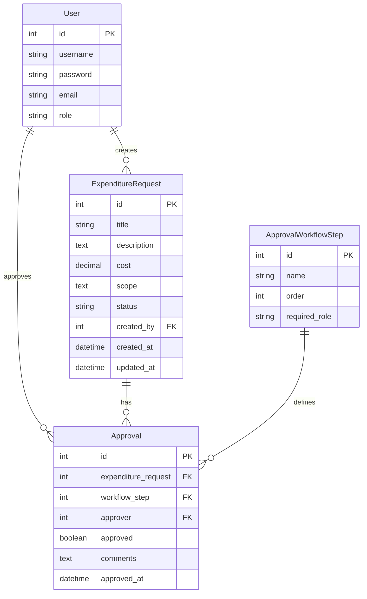

# ERD for Expenditure Approval System

# Explanation of Design Decisions for Expenditure Approval System

1. User Model:
   - We extended Django's AbstractUser to include a role field, allowing us to assign specific roles to users.
   - Roles are defined as choices to ensure data consistency and to make it easier to validate and display role information.

2. ExpenditureRequest Model:
   - This model represents the core entity of our system, the Expenditure Request (AFE).
   - It includes fields for title, description, cost, scope, and status to capture all necessary details.
   - The status field uses choices to ensure only valid statuses can be assigned.
   - We included created_by as a foreign key to User to track who created each request.
   - created_at and updated_at fields are included for auditing purposes.
   - An index on status and created_at is added to optimize queries that filter or sort by these fields.

3. ApprovalWorkflowStep Model:
   - This model defines the steps in the approval workflow.
   - The order field ensures that steps can be arranged in a specific sequence.
   - required_role links each step to a specific user role.
   - A unique constraint on order and required_role ensures that each role has a unique position in the workflow.

4. Approval Model:
   - This model represents individual approval actions.
   - It links to ExpenditureRequest, ApprovalWorkflowStep, and User to capture who approved what at which stage.
   - The approved field is a boolean to clearly indicate the approval decision.
   - Comments allow approvers to provide additional context for their decisions.
   - A unique constraint on expenditure_request, workflow_step, and approver ensures that each user can only approve once for each step of a request.
   - An index on expenditure_request and workflow_step is added to optimize queries that retrieve approvals for a specific request and step.

5. Relationships:
   - Users can create multiple ExpenditureRequests (one-to-many).
   - Users can make multiple Approvals (one-to-many).
   - Each ExpenditureRequest can have multiple Approvals (one-to-many).
   - Each ApprovalWorkflowStep can be associated with multiple Approvals (one-to-many).

6. Data Integrity and Normalization:
   - Foreign key relationships ensure referential integrity.
   - The use of separate models for Users, ExpenditureRequests, ApprovalWorkflowSteps, and Approvals follows normalization principles, avoiding data redundancy.
   - Choices for status and roles help maintain data consistency.

7. Indexing and Constraints:
   - Indexes are added on fields that are likely to be frequently queried or used in sorting.
   - Unique constraints are used to enforce business rules (e.g., unique approval per user per step per request).

This design provides a flexible and scalable structure for the expenditure approval system, allowing for easy tracking of requests, a customizable approval workflow, and clear audit trails of all actions taken.
